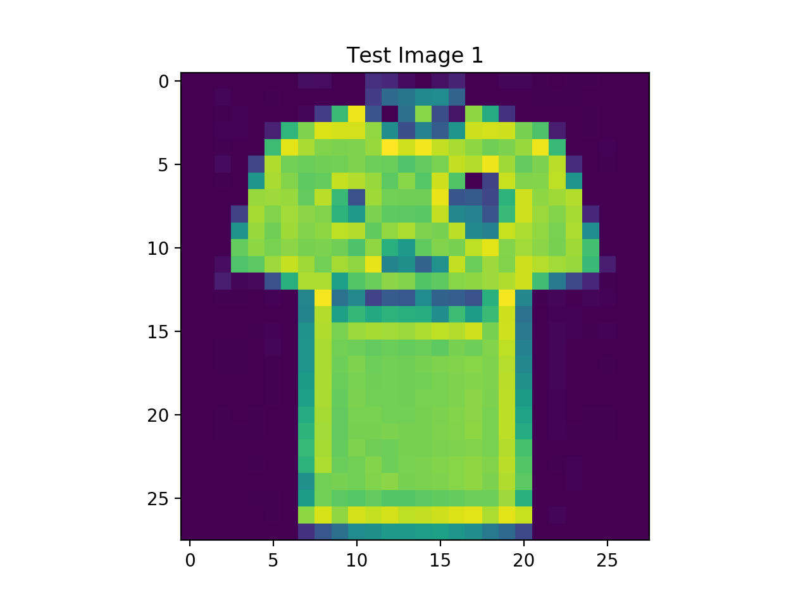

# ClothesClassifier
Implemented a neural network that classifies different articles of clothing, only using Numpy to understand fundamentals.

## Installation
Use the pip package manager to install the following packages.
```bash
pip install numpy
pip install scipy
pip install -U scikit-learn
pip install matplotlib
```

## Running Python Files
Ensure you have python version >= 3.5 by entering the following in your terminal.
```bash
python --version
```
Clone the repository to your Desktop by entering the following commands.
```bash
cd ~/Desktop
git clone https://github.com/aakarsharya/ClothesClassifier.git
```
To run the files in this repository, you must first navigate to this directory from your terminal.
```bash
cd ClothesClassifier
```
To watch the neural network train itself, run nn.py from your terminal with the following command.
```bash
python train.py
```
To test the neural network's accuracy, run test.py from your terminal with the following command.
```bash
python test.py
```
Remember to close the test image to allow the program to continue.

## How it Works
### Training the Neural Network (train.py)
This program trains the neural network using thousands of clothes images, with labels that tell the network what article of clothing each image corresponds to. During training, the network tunes its weights and stores them in a .txt when finished training.

This program gives you the option to provide your own neural network architecture. 
```bash
Would you like to construct your own neural network? (y/n):
```
If you enter 'y', you will first need to specify the number of hidden layers you wish to use.
```bash
Enter number of hidden layers (excluding input and output layer): 3
```

Then you will specify how many neurons you wish to have in each hidden layer.
```bash
Enter size of hidden layer 1: 32
Enter size of hidden layer 2: 32
Enter size of hidden layer 3: 32
You constructed a 784 -> 32 -> 32 -> 32 -> 10 network.
```

Finally, the program will train over 2000 epochs, and store the new weights. When training is completed, the program will display a graph of cost vs. number of iterations to show you how gradient descent progressed for this architecture. 

You can test the accuracy of this new architecture by running test.py.

### Testing the Neural Network (test.py)
When you run test.py, you will be prompted to enter an index number. This corresponds to new images from a dataset that neural network has never seen before. However, the network uses its tuned weights, which have been trained using the training dataset, to make a prediction. 

The program will first display the f1-score, accuracy, and precision of the current neural network.

Then, the program will display the test image corresponding to the index you entered, and output the prediction when you close the image. For example if you enter 1 when prompted for the index, you should see the following.

```bash
The neural network thinks this is a T-shirt.
Correct! This is a T-shirt.
Try again? (y/n):
```
To end the program, enter 'n', try again with a new index enter 'y'.
